# Batalha-Interestelar
Peguei o jogo que fiz no início da minha graduação, quando estava aprendendo lógica de programação, e me desafiei a melhorar o jogo, já que na época não consegui implementar muita coisa.

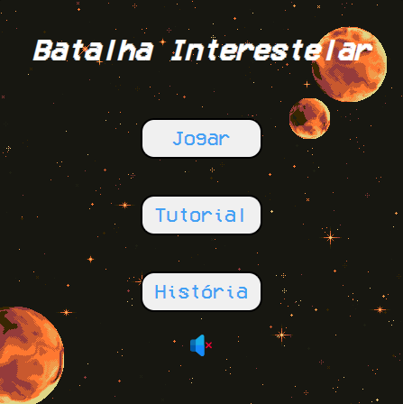

## 🔧 Funçoes 

### Menu:
O menu contém três botões o de Jogar, Tutorial e História, cada botão redireciona para outra página, o menu também conta com uma imagem de som mutado.

### Jogar:
Ao clicar no botão Jogar a página de jogo é carregada, começando pelo nível 1, que contém apenas um tipo de inimigo, o jogo conta com 5 níveis, cada nível tem um cenário de fundo diferente, além de ter 5 tipos de inimigo, sendo um deles o chefão.

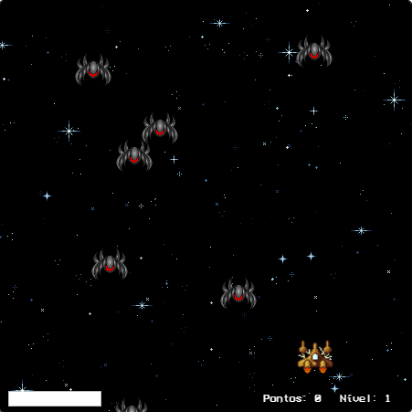

Quando o jogador passa de nível aparece uma animação indicando o level up e o cenário de fundo é alterado.

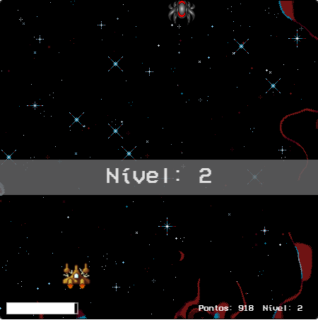

### Níveis:
O primeiro nível tem só um tipo de inimigo, que é destruído apenas com um tiro do jogador.

O segundo nível tem dois tipos de inimigos, inimigos nível 1 e nível 2, para destruir os inimigos de nível 2 é necessário 2 tiros do jogador.

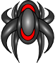

O terceiro nível tem dois tipos de inimigos, inimigos nível 1 e nível 3, para destruir os inimigos de nível 3 é necessário 3 tiros do jogador.

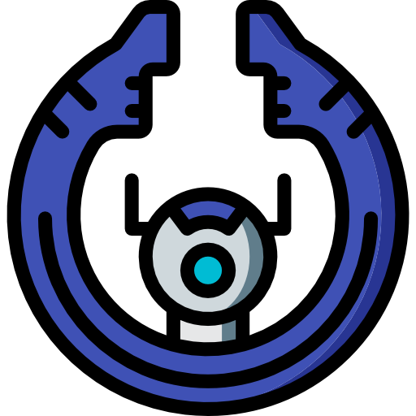

O quarto nível tem dois tipos de inimigos, inimigos nível 1 e nível 4, para destruir os inimigos de nível 4 é necessário 4 tiros do jogador.

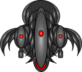

O quinto e último nível tem só um inimigo, que é o chefão e para destruir o chefão é necessário 100 tiros do jogador.

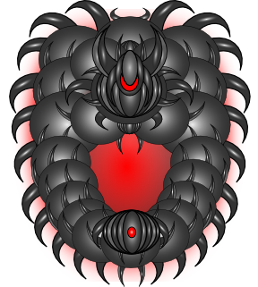

### Bônus:
Quando um inimigo é destruído tem 30% de chance de dropar um bônus de vida, que recupera a vida perdida do jogador, ou de aumento na velocidade de disparo do jogador.

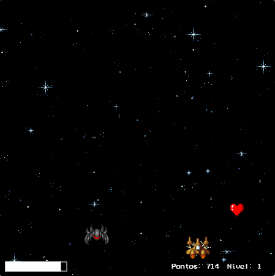
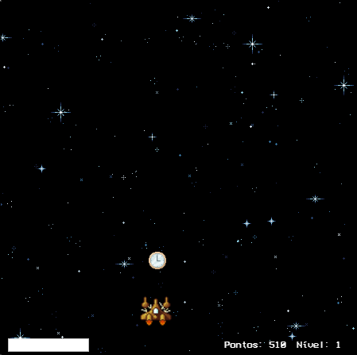

### Tutorial:
Página com as informações de como jogar.

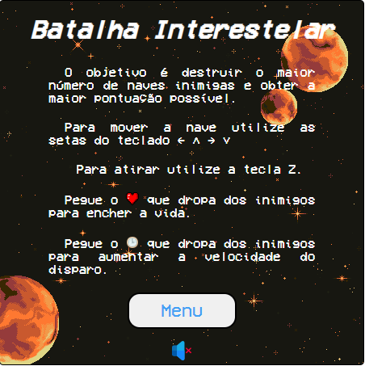

### História:
Página com a história do jogo.

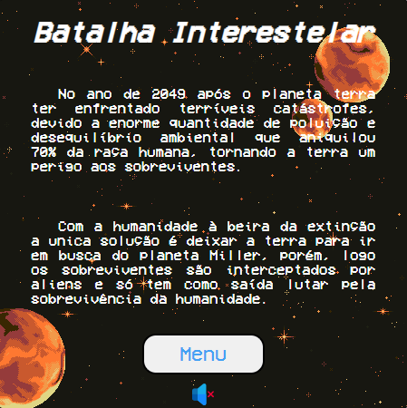

### Fim de jogo:
Quando a vida do jogador chegar a zero ou a vida do chefão chegar a zero, é carregada a página de fim de jogo que contém a mensagem de game over, quando o jogador perde, ou a mensagem de congratulations, quando o jogador vence, além de ter a pontuação total do jogador.

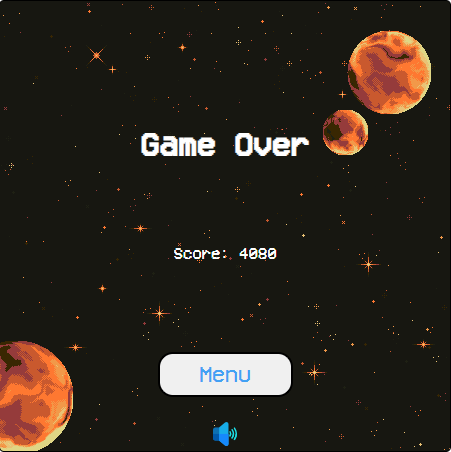
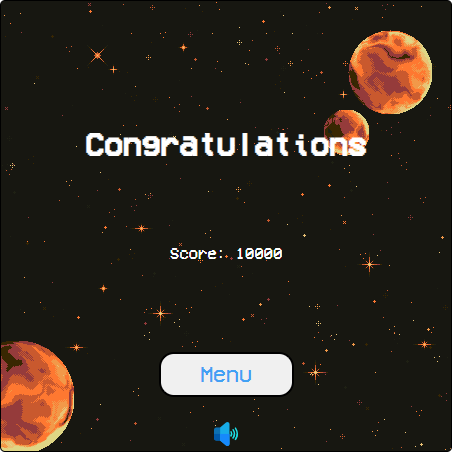

## Feito Com:

Copyright © DavidWillian
